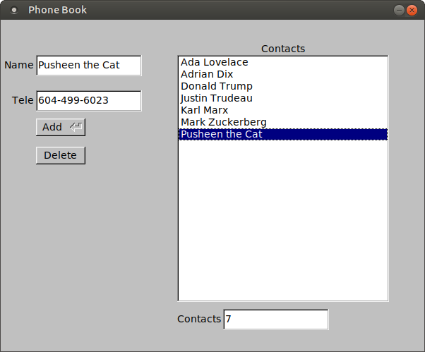

# Phonebook
Functional phonebook that uses file I/O and FLTK to store names and phone numbers

<p align="center">
  
</p>

### Features
<ul>
  <li>Fully functional phonebook program to add, manage, and delete contacts</li>
  <li>Sorts contacts alphabetically</li>
  <li>Minimalist features</li>
  <li>Stores phonebook information with file I/O</li>
</ul>

### Usage

```
python PhoneBook.py
```
```
./PhoneBook.py
```

For best results, please ensure Python 2.7 and the FLTK toolkit are installed on your device
FLTK can be easily installed on Centos and Ubuntu
```
sudo apt-get install python-fltk
```
## Author

* **Rebecca Louie** - - (https://github.com/rebecca-louie)

